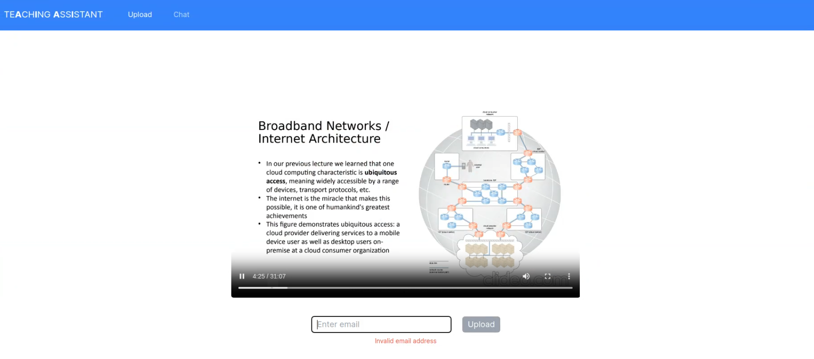
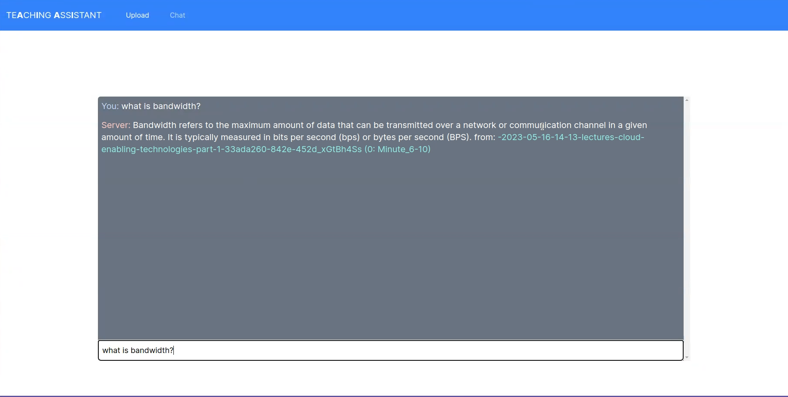

# Teaching Assistant 2.0 using WizardLM 

- Upload any video and chat with its content. Also gives you the source. (For ex: {video_name}-{min_5_to_10})
- This implementation only uses opensource models and tools.
- Microservices hosted on the AWS and GPU services (`embedding generation` and `LLM inference`) are hosted on [Lambda labs](https://lambdalabs.com).
- This project uses `instructor-xl` model for embedding db generation and `WizardLM` LLM for chat.

### Architecture:

### Screenshots:

- I uploaded one of our Cloud Computing lectures which was about common terminologies used in Cloud Computing.

- Chat interface:

